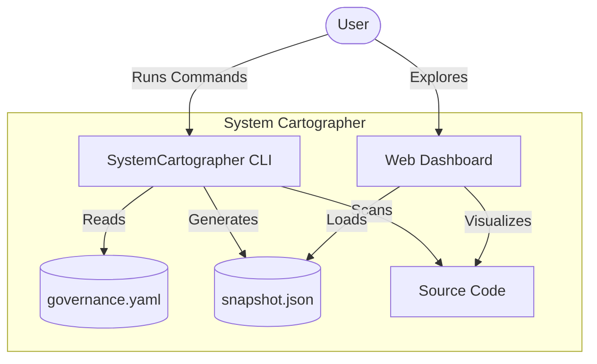

# Mystery Machine

> **Atomic-level intelligence for enterprise legacy modernization.**

Mystery Machine scans your codebase, reconstructs its architectural DNA, and provides interactive visualizations to help you navigate, refactor, and govern complex systems.

## 🚀 Key Features

- **Autonomy-Level Scanning**: Parses C# (Roslyn) and SQL (T-SQL DOM) into atomic units (Classes, Properties, Methods, Tables, Procs).
- **Semantic Linking**: Infers relationships that compilers miss (e.g., EF Core Column mappings, Dapper inline SQL).
- **Interactive Dashboard**: A React/D3.js visualization suite enabling "Time Travel" through commit history and deep-dive architectural exploration.
- **Active Governance**: Enforce architectural rules (Layering, Forbidden Dependencies, Visibility) via a simple `governance.yaml`.
- **CI/CD Ready**: Zero-config CLI compliant with automated pipelines (`--ci` mode).

---

## 🏛️ Architecture: The C4 Model

System Cartographer aligns with the **C4 Model** for software architecture:



- **Level 1 (System)**: The Federation view (Multi-repo).
- **Level 2 (Container)**: Projects and Namespaces.
- **Level 3 (Component)**: Classes and Services.
- **Level 4 (Code)**: Methods, Properties, and Inline SQL.

---

## 📦 Quick Start

### Prerequisites

- .NET 8 SDK (Backend)
- Node.js 20+ (Frontend)

### 1. Build the System

```bash
# Build the CLI and Core libraries
dotnet build SystemCartographer.slnx

# Build the Dashboard
cd dashboard
npm install
npm run build
cd ..
```

### 2. Scan a Repository

```bash
# Run the scanner
dotnet run --project src/SystemCartographer.Cli -- scan --repo /path/to/your/repo --output snapshot.json
```

### 3. Launch the Dashboard

Serve the dashboard (using any static file server) or run it in dev mode:

```bash
cd dashboard
npm run dev
# Open http://localhost:5173
```

_Note: In production (Docker), the CLI and Dashboard are packaged together._

---

## 🛡️ Governance & Rules

Enforce architecture as code by placing a `governance.yaml` file in your repository root.

**Example `governance.yaml`:**

```yaml
version: 1.0
definitions:
  web:
    namespace: "MyApp.Web.*"
  data:
    namespace: "MyApp.Data.*"

rules:
  # Layering: Web -> Data is valid. Data -> Web is FORBIDDEN.
  - type: layering
    mode: strict
    layers:
      - "@web"
      - "@data"

  # Visibility: Only specific consumers can touch 'Internal'
  - type: visibility
    target: "@internal_core"
    allowed_consumers:
      - "@admin_utils"
```

_See [docs/governance_rules.md](docs/governance_rules.md) for full documentation._

---

## 🛠️ CLI Reference

### `scan`

Generates a snapshot of a repository.

```bash
cartographer scan --repo <path> --output <file.json> [--ci]
```

- `--repo`: Path to the root of the code to scan.
- `--output`: Where to save the JSON snapshot.
- `--ci`: Disables interactive emojis/colors for log files.

### `diff`

Compares two snapshots to find regression or drift.

```bash
cartographer diff --baseline main.snapshot.json --current feature.snapshot.json
```

---

## 🏗️ Project Structure

- `src/SystemCartographer.Core`: Foundational data models (CodeAtom, Link).
- `src/SystemCartographer.Scanner.*`: Language-specific parsers.
- `src/SystemCartographer.Cli`: The command-line orchestration tool.
- `dashboard/`: The React + D3.js frontend visualization.
- `MassiveRepo/`: (Generated) A synthetic 1,000-class repository for stress testing (Local only).

---

## 📜 License

Internal Enterprise Use.
