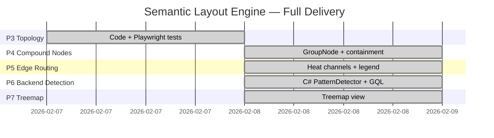

# Semantic Layout Engine — Roadmap

> **Status**: P1–P5 complete ✅ — P6–P7 planned.

---

## Phase 3: Topology Detection ✅

| Item                                                                         | File                                                     |
| ---------------------------------------------------------------------------- | -------------------------------------------------------- |
| `detectTopology()` — hub‑spoke, pipeline, disconnected, mesh, layered        | `useGraphLayout.ts`                                      |
| `inferArchitecturalLayer()` — presentation/application/domain/infra/external | `useGraphLayout.ts`                                      |
| ELK `radial` algorithm + >25 node fallback to layered                        | `useGraphLayout.ts`                                      |
| Hub indicator (amber glow + `⊛ HUB` badge)                                   | `CardNode.tsx`, `index.css`                              |
| Stereotype shapes (hexagon, octagon, diamond, rounded)                       | `CardNode.tsx`, `index.css`                              |
| Playwright E2E: navigation, topology, layout                                 | `graph-navigation.spec.ts`, `topology-detection.spec.ts` |

---

## Phase 4: Compound / Nested Nodes ✅

| Item                                                     | File                     |
| -------------------------------------------------------- | ------------------------ |
| `GroupNode.tsx` — frosted‑glass container zones          | `GroupNode.tsx`          |
| ELK compound layout with `parentId` + `extent: 'parent'` | `useGraphLayout.ts`      |
| Group nodes registered in graph                          | `WorkflowGraph.tsx`      |
| Playwright E2E: containment, bounds, handles, drill‑down | `compound-nodes.spec.ts` |

---

## Phase 5: Edge Bundling + Port Routing ✅

| Item                                                             | File                   |
| ---------------------------------------------------------------- | ---------------------- |
| `classifyPort()` — semantic port side mapping (N/S/E/W)          | `useGraphLayout.ts`    |
| `classifyHeat()` + `getHeatStyle()` — 4‑tier heat channels       | `useGraphLayout.ts`    |
| Heat colors: 🟢 clean · 🟡 warning · 🔴 violation · 🟣 hierarchy | `useGraphLayout.ts`    |
| `EdgeLegend.tsx` — 🔥 toggle overlay with color key + port sides | `EdgeLegend.tsx`       |
| ELK SPLINES routing for smooth curved edges                      | `useGraphLayout.ts`    |
| Playwright E2E: heat palette, legend toggle, label content       | `edge-routing.spec.ts` |

---

## Phase 6: Backend `PatternDetector` ✅ (Feb 8 2026)

Graduate topology detection from frontend TypeScript to C# backend, leveraging the existing
`KnowledgeGraph` indexes and `GraphQueryEngine` for richer, server‑side analysis.

### Goals

1. **Server‑side topology detection** — move `detectTopology()` logic to C# where it has access to full graph indexes, historical scan diffs, and cross‑repo data
2. **Layout hints via GraphQL** — return a `LayoutHint` record so the frontend can skip client‑side detection and use authoritative server analysis
3. **Richer pattern detection** — leverage `CalculateCentrality()`, `FindCycles()`, and namespace indexes for higher‑confidence classification
4. **Backward compatibility** — frontend falls back to client‑side detection if the API field is absent

### Deliverables

| #   | Item                      | File                             | Description                                                                                 |
| --- | ------------------------- | -------------------------------- | ------------------------------------------------------------------------------------------- |
| 1   | `LayoutHint` record       | `GraphTypes.cs`                  | `Pattern`, `Confidence`, `HubNodeId?`, `PipelineOrder?`, `LayerAssignments`                 |
| 2   | `PatternDetector` service | `PatternDetector.cs` [NEW]       | Analyze a subgraph → `LayoutHint` using degree distribution, path analysis, name heuristics |
| 3   | `DetectTopology()` method | `GraphQueryEngine.cs`            | Orchestrates PatternDetector against the KnowledgeGraph                                     |
| 4   | `GetLayoutHint` resolver  | `GraphQuery.cs`                  | GraphQL query: `layoutHint(scopeId: ID): LayoutHint`                                        |
| 5   | Frontend integration      | `useGraphLayout.ts`              | Read `layoutHint` from API response, fall back to client `detectTopology()`                 |
| 6   | Unit tests (C#)           | `PatternDetectorTests.cs` [NEW]  | 8 test cases for all topology patterns                                                      |
| 7   | Integration tests         | `GraphQLApiRequirementsTests.cs` | Verify `layoutHint` query returns valid data                                                |
| 8   | Frontend tests            | `useGraphLayout.test.ts`         | Test fallback behavior when API hint is/isn't present                                       |

### GraphQL Schema Addition

```graphql
type LayoutHint {
  pattern: String! # hub-spoke | pipeline | layered | mesh | disconnected
  confidence: Float! # 0.0–1.0
  hubNodeId: String # only for hub-spoke
  pipelineOrder: [String!] # only for pipeline
  layerAssignments: [LayerAssignment!]
}

type LayerAssignment {
  nodeId: String!
  layer: String! # presentation | application | domain | infrastructure | external
}
```

### Detection Algorithm (C# port)

| Pattern          | Detection Strategy                                      | Confidence Source           |
| ---------------- | ------------------------------------------------------- | --------------------------- |
| **Hub‑spoke**    | Max‑degree node ≥ 40% of total edges                    | `CalculateCentrality()`     |
| **Pipeline**     | Longest path covers ≥ 60% of nodes, branch factor ≤ 1.5 | BFS from source nodes       |
| **Layered**      | ≥ 40% of nodes match architectural layer names          | Namespace + name heuristics |
| **Disconnected** | Edge count < 30% of node count                          | Simple ratio check          |
| **Mesh**         | Fallback — no dominant pattern detected                 | Low confidence              |

### Test Plan

#### Unit Tests — `PatternDetectorTests.cs` (8 tests)

| #   | Test                        | Input                           | Expected                              |
| --- | --------------------------- | ------------------------------- | ------------------------------------- |
| 1   | Classic hub                 | 1 node with 80% of edges        | `hub-spoke`, hubNodeId set            |
| 2   | Linear chain                | 10 nodes in sequence            | `pipeline`, pipelineOrder = [a…j]     |
| 3   | Layered names               | Controllers → Services → Domain | `layered`, layer assignments          |
| 4   | No edges                    | 10 isolated nodes               | `disconnected`, confidence = 1.0      |
| 5   | Mesh fallback               | Fully connected 6‑node graph    | `mesh`                                |
| 6   | Cycle detection integration | A→B→C→A                         | Does not crash, returns valid pattern |
| 7   | Single node                 | 1 node, 0 edges                 | `disconnected`                        |
| 8   | Mixed signals               | Hub + pipeline traits           | Highest‑confidence pattern wins       |

#### Integration Tests — `GraphQLApiRequirementsTests.cs` (2 tests)

| #   | Test                              | Assertion                                       |
| --- | --------------------------------- | ----------------------------------------------- |
| 9   | `layoutHint` query returns data   | Response has `pattern`, `confidence` > 0        |
| 10  | `layoutHint` with scopeId filters | Returns pattern for specific namespace subgraph |

#### Frontend Tests — `useGraphLayout.test.ts` (2 tests)

| #   | Test                                   | Assertion                                      |
| --- | -------------------------------------- | ---------------------------------------------- |
| 11  | API hint present → uses server pattern | `detectTopology()` not called when hint exists |
| 12  | API hint absent → falls back to client | Client‑side detection runs as before           |

---

## Phase 7: Treemap View ✅ (Feb 8 2026)

Proportional sizing view for repo-level overview (L2 containers).

| Item                                   | Description                         |
| -------------------------------------- | ----------------------------------- |
| Squarified treemap algorithm           | Area ∝ `AtomCount` or `LinesOfCode` |
| Toggle between graph and treemap at L2 | View selector in toolbar            |
| Click‑to‑drill into container          | Rectangle click → L3 namespace view |

---

## Delivery Sequence



---

## Test Coverage

| Layer                | Tool       | Files                                                      | Status                    |
| -------------------- | ---------- | ---------------------------------------------------------- | ------------------------- |
| Unit (layout + heat) | Vitest     | `useGraphLayout.test.ts`                                   | ✅ 40/40                  |
| Unit (treemap)       | Vitest     | `useTreemapLayout.test.ts`                                 | ✅ 6/6                    |
| Unit (components)    | Vitest     | `Header.test.tsx`, `DetailsPanel.test.tsx`, `App.test.tsx` | ✅ 12/12                  |
| E2E (navigation)     | Playwright | `graph-navigation.spec.ts`                                 | ✅ 4 tests                |
| E2E (topology)       | Playwright | `topology-detection.spec.ts`                               | ✅ 8 tests                |
| E2E (compound)       | Playwright | `compound-nodes.spec.ts`                                   | ✅ 7 tests                |
| E2E (edge routing)   | Playwright | `edge-routing.spec.ts`                                     | ✅ 8 tests                |
| E2E (treemap)        | Playwright | `treemap.spec.ts`                                          | ✅ 4 tests                |
| **Total**            |            |                                                            | **56 unit + 31 e2e = 87** |
